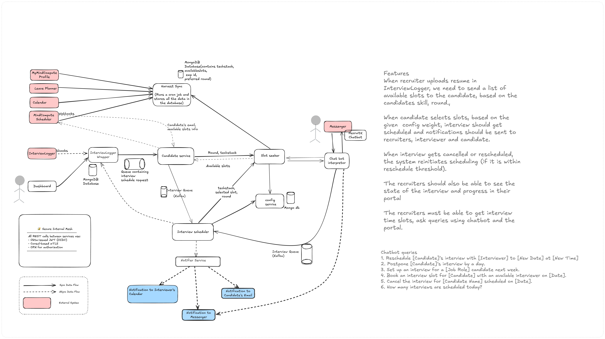
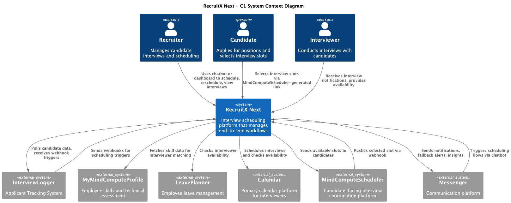
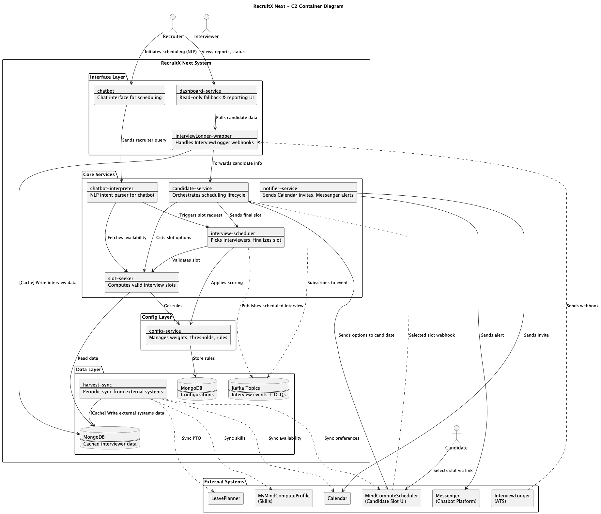

# RecruitX Next – Interview Scheduling Platform | Architectural Kata 2025

> The comeback of a loved tool — redesigned, reimagined.

Welcome to our architectural submission for **ArchKata 25**.  
**RecruitX Next** is a resilient, extensible, and observable interview scheduling platform that automates recruiter
workflows and supports fallback mechanisms for real-world edge cases.

---

## 📌 Problem Statement

Recruiters at MindCompute are spending far too much time manually coordinating interviews—matching skills, checking
availability, avoiding scheduling conflicts, and handling declines. The current process involves multiple systems
(InterviewLogger, MindComputeScheduler, MyMindComputeProfile, LeavePlanner) but no centralized intelligence or automation. The result? Missed
interviews, double bookings, rescheduling chaos, frustrated interviewers and candidates.

Our goal is to streamline and automate the **interviewer discovery**, **scheduling**, **rescheduling**, and
**notification flow** with a smart, integrated system and chatbot interface — reducing manual effort and accelerating
the hiring process.

---

## 🧭 Resources

This repository documents the architecture, rationale, and design strategy for **RecruitX Next**, our scalable,
cache-first interview scheduling system submitted for ArchKata 2025.

---

## ✨ Solution Highlights

- 🔁 **Cache-as-Primary Reads** — MongoDB TTL-backed cache with background sync from external systems
- 💬 **Multichannel Interface** — Messenger chatbot + read-only dashboard for recruiters
- ⚠️ **DLQ + Alerting Built-In** — Resilient retries with manual fallback and observability
- 🧠 **LLM-Enhanced** — Pluggable NLP/LLM layer for chatbot understanding and summarization
- 🛡️ **Secure by Design** — OIDC, OPA, Vault, and mTLS across a Consul-managed service mesh

---

## 🧱 System Overview

- **Architecture Style**: Event-driven microservices
- **Core Qualities**: Resilient, Observable, Configurable, AI-Augmented
- **Deployment**: GitOps-first, Kubernetes-native, Cloud-agnostic
- **Security Stack**: OIDC + OPA + mTLS + Vault
- **Tech Stack**: Go, Python, Kafka, MongoDB, Flutter, Gemini/Ollama, ArgoCD, Consul

---

## 🗂️ Architecture Diagrams

| Diagram          | Status     | File                                                                                                                                                                                                                        |
|------------------|------------|-----------------------------------------------------------------------------------------------------------------------------------------------------------------------------------------------------------------------------|
| HLD – High Level | ✅ Complete |                                                                                                                                                                                                   |
| C1 – Context     | ✅ Complete |                                                                                                                                                                                 |
| C2 – Containers  | ✅ Complete |                                                                                                                                                                           |
| C3 – Components  | ✅ Complete | [C3InterviewScheduler.png](images/C3InterviewScheduler.png)    [C3SlotSeeker.png](images/C3SlotSeeker.png)   [C3HarvestSync.png](images/C3HarvestSync.png)   [C3NotifierService.png](images/C3NotifierService.png) |
| C4 – Code        | ✅ Complete | [C4InterviewScheduler.png](images/C4InterviewScheduler.png)    [C4SlotSeeker.png](images/C4SlotSeeker.png)   [C4HarvestSync.png](images/C4HarvestSync.png)   [C4NotifierService.png](images/C4NotifierService.png) |

📎 See [`Diagrams.md`](./docs/Diagrams.md) for a visual index and design evolution notes.

---

## 📄 Core Design Docs

| Document                                                | Description                                   |
|---------------------------------------------------------|-----------------------------------------------|
| [`ArchitectureStyle.md`](./docs/ArchitectureStyle.md)   | Architecture patterns and service strategy    |
| [`Characteristics.md`](./docs/Characteristics.md)       | System quality attributes and non-functionals |
| [`Tradeoffs.md`](./docs/Tradeoffs.md)                   | Key tradeoffs and justification               |
| [`Techstack.md`](./docs/Techstack.md)                   | Tech stack and ecosystem rationale            |
| [`AITools.md`](./docs/AITools.md)                       | LLM/NLP usage and integration strategy        |
| [`DeploymentStrategy.md`](./docs/DeploymentStrategy.md) | GitOps, Helm, Terraform, K8s setup            |
| [`Microservices.md`](./docs/Microservices.md)           | Service breakdown, DLQ usage, cache flow      |

---

## 📘 Reference Docs

| Document                                              | Description                                 |
|-------------------------------------------------------|---------------------------------------------|
| [`Glossary.md`](./docs/Glossary.md)                   | Roles and domain terms across the system    |
| [`UserJourneys.md`](./docs/UserJourneys.md)           | Candidate, recruiter, and interviewer flows |
| [`AssumptionsAndFAQ.md`](./docs/AssumptionsAndFAQ.md) | Functional assumptions and FAQs             |

---

## 🔍 Traceability

See [`TraceabilityMatrix.md`](./docs/TraceabilityMatrix.md) for a complete mapping of:

- Functional and non-functional requirements
- Supporting design elements and tradeoffs
- LLM and external system integration paths

---

## 📚 ADRs – Reading Order

| ADR #   | Filename                                                                         | Title                                    |
|---------|----------------------------------------------------------------------------------|------------------------------------------|
| ADR-001 | [architecture-style.md](./docs/adrs/ADR-001-architecture-style.md)               | Architecture Style                       |
| ADR-002 | [architecture-approach.md](./docs/adrs/ADR-002-architecture-approach.md)         | Architecture Approach                    |
| ADR-003 | [tech-stack-choice.md](./docs/adrs/ADR-003-tech-stack-choice.md)                 | Tech Stack Choice                        |
| ADR-004 | [quality-tradeoffs.md](./docs/adrs/ADR-004-quality-tradeoffs.md)                 | Quality Tradeoffs                        |
| ADR-005 | [cache-as-primary-read.md](./docs/adrs/ADR-005-cache-as-primary-read.md)         | Cache-as-Primary Read Strategy           |
| ADR-006 | [dlq.md](./docs/adrs/ADR-006-dlq.md)                                             | DLQ Strategy for Kafka Workflows         |
| ADR-007 | [external-systems-raid.md](./docs/adrs/ADR-007-external-systems-raid.md)         | External Integration Assumptions & Risks |
| ADR-008 | [config-driven-scheduling.md](./docs/adrs/ADR-008-config-driven-scheduling.md)   | Config-Driven Scheduling                 |
| ADR-009 | [service-mesh-consul-envoy.md](./docs/adrs/ADR-009-service-mesh-consul-envoy.md) | Service Mesh – Consul + Envoy            |
| ADR-010 | [gitops-argocd.md](./docs/adrs/ADR-010-gitops-argocd.md)                         | GitOps with ArgoCD                       |
| ADR-011 | [shift-left-security.md](./docs/adrs/ADR-011-shift-left-security.md)             | Shift-Left Security                      |
| ADR-012 | [nlp-chatbot.md](./docs/adrs/ADR-012-nlp-chatbot.md)                             | NLP Chatbot Capabilities                 |
| ADR-013 | [manual-fallback.md](./docs/adrs/ADR-013-manual-fallback.md)                     | Manual Fallback via Dashboard & Chatbot  |

---

## ⚠️ Known Limitations

- **MindComputeScheduler API Assumption** — Integration assumes working APIs for preference sync/load balancing; not
  contract-verified.
- **Dashboard Is Read-Only** — MVP dashboard offers reporting only; no interview actions supported.
- **Cache-First with Deferred Sync** — Background sync may cause brief staleness.
- **LLM Provider Not Benchmarked** — Gemini/Ollama support is pluggable but not evaluated.
- **Manual Feedback Collection** — Feedback flow is nudged, not auto-collected.
- **No Smart Retry or Auto-Escalation** — Recruiters must initiate fallback; no auto-reschedule yet.
- **Chatbot-Only Manual Recovery** — Recovery actions (retry, override) supported only via Messenger, not UI.
- **Single-Tenant Only** — Multi-tenancy is out of scope; RecruitX is designed for MindCompute.

---

## ✅ Submission Checklist – ArchKata25

- [x] C1 – Context Diagram
- [x] C2 – Container Diagram
- [x] C3 – Component Diagram
- [x] C4 – Code Diagram
- [x] Architecture characteristics documented
- [x] Tradeoffs explained and justified
- [x] ADRs structured and referenced
- [x] Assumptions and integration risks covered
- [x] AI & LLM usage + fallback strategy detailed
- [x] GitOps-first deployment strategy shared

---

## 🧠 Final Word

**RecruitX Next** is designed to scale, recover, and adapt — fit for real-world scheduling under pressure.

It blends:

- Event-driven architecture
- Secure APIs
- Cache-first reads
- AI-enhanced workflows
- Observable infrastructure
- Fallback resilience

---

## 🙌 Team

Member 1: [Aadhithya Ramesh](https://github.com/AadhiRamesh)

Member 2: [Nithya N](https://github.com/nithyanatarajan)

Member 3: [Vishwa Priya J](https://github.com/vishwapriya)

> This repository is our ArchKata 25 submission. All design decisions reflect architectural intent, not implementation.

Thanks for reading! 🙏
